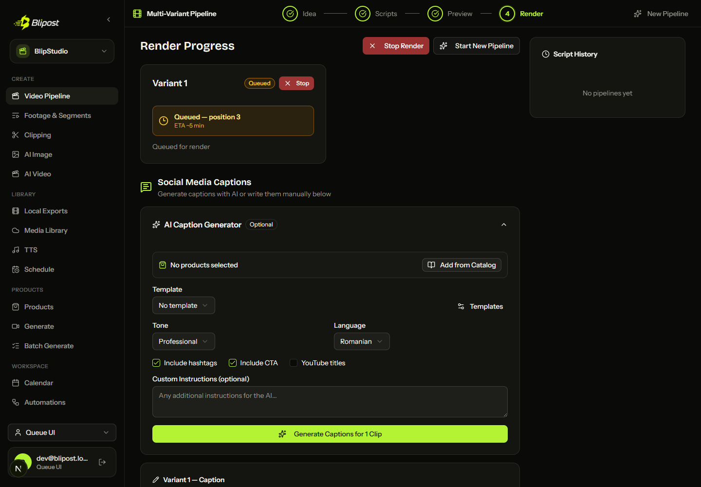
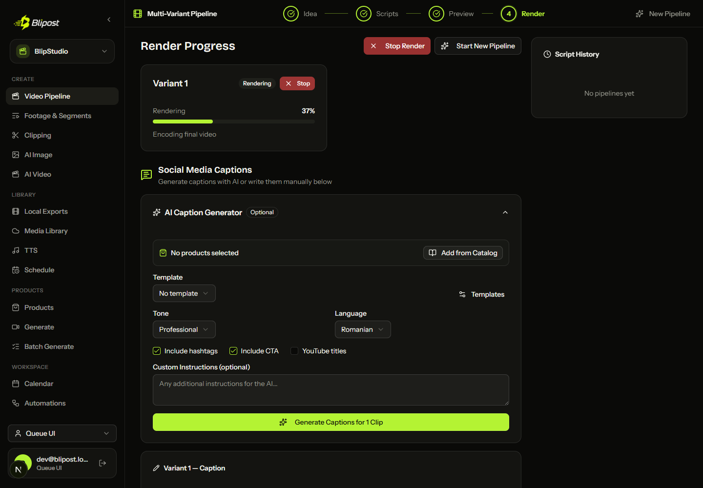

# Fair multi-tenant render queue

Status on 2026-07-15: Goal C is implemented, committed locally, and verified.
No deployment, database migration, render-fleet integration, or push was
performed.

## Launch contract

Final Pipeline renders and remakes now enter one `FairRenderQueue` singleton in
the FastAPI process before taking an FFmpeg slot. The fairness key is
`ProfileContext.user_id`, not `profile_id`, so profiles owned by the same user
share one tenant lane.

The scheduler guarantees:

- round-robin dispatch between users with runnable work;
- FIFO ordering inside each user's lane;
- the existing final-render capacity remains authoritative, including an
  explicit `MAX_CONCURRENT_RENDERS` override and the existing adaptive default;
- the existing `acquire_render_slot()` semaphore still wraps the actual render,
  so the scheduler does not create a second, divergent concurrency limit;
- Meta A/B dependency gates preserve version ordering without letting a blocked
  user prevent another user's ready work from taking a slot.

The queue is intentionally in memory and scoped to one backend
process/container. It provides launch-safe fairness for the current single
container, not distributed scheduling across replicas.

## Lifecycle and API status

The render endpoint persists every selected job as `queued` before returning.
It then registers all queue tickets and starts the existing asynchronous
background callbacks. A callback changes the persisted job to `processing` only
after the fair ticket and FFmpeg semaphore have both admitted it.

`GET /api/v1/pipeline/status/{pipeline_id}` keeps the existing variant payload
and adds two nullable fields for queued jobs:

- `queue_position`: one-based position in the scheduler's projected fair order;
- `eta_seconds`: approximate wait derived from current active work, configured
  capacity, and recent render duration.

The estimator averages the last 20 completed render durations in the process.
Until it has observations it uses
`RENDER_QUEUE_DEFAULT_DURATION_SECONDS` (default: 300 seconds). ETA is a hint,
not a deadline: render complexity, cancellation, and process restart can change
it.

Step 4 renders queued work as a distinct amber state with `Queued — position
N`, an `ETA ~N min` label, and an immediately available Stop action. Once the
poll response changes to `processing`, the card switches to `Rendering`, the
progress bar, percentage, and current render step.

## Cancellation and restart semantics

Per-variant and whole-pipeline cancellation first ask the scheduler to remove a
queued or granted ticket, then persist `cancelled`. This frees the projected
position and lets the next fair job dispatch immediately. A ticket already
running follows the existing cooperative render cancellation path.

Queue callbacks and FFmpeg process state cannot be reconstructed safely after a
backend crash. When a pipeline is first loaded from persistence after restart,
any `queued` or `processing` render is therefore changed to:

- status `failed`;
- progress `0`;
- `interrupted: true`;
- current step `Render întrerupt — apasă Render din nou`;
- an error that asks the user to submit the render again.

This is deliberate fail-honest recovery. The API never displays a vanished
in-memory reservation as though it were still runnable.

## Verification record

- Scheduler tests prove the exact two-user, three-job order
  `alice-1, bob-1, alice-2, bob-2, alice-3, bob-3`, FIFO per user, queue
  position/ETA, recent-duration averaging, queued cancellation, and dependency
  gating that does not block another tenant.
- Pipeline integration tests prove status fields, instant queued cancellation,
  and restart conversion for both queued and processing records.
- Existing SQLite pipeline compatibility suites passed: 18 passed, 1 xfailed.
- Frontend TypeScript passed; focused ESLint had zero errors (13 existing
  warnings); the deterministic Playwright test passed and observed the queued
  state transition to `Rendering / 37% / Encoding final video`.
- Full backend suite: **564 passed, 1 skipped, 18 xfailed, 0 failed** across 583
  collected tests in 55.83 seconds. A Windows binary-mode fix made the existing
  desktop signing-key reuse test deterministic when random key material contains
  `0x0A`.

Queued state:

Transitioned rendering state:

Implementation commits are `da045bf` (scheduler), `0f5eb5c` (Pipeline
integration), `5f4586f` (Step 4 UI), and `1be43a1` (Windows test-suite flake).
The pre-existing dirty target files were preserved first in checkpoint commit
`6d680b8`.

## Post-launch scale path (not integrated)

Do not run multiple API replicas against this in-memory queue and assume global
fairness. The next scale phase should route renders through a shared durable
queue and the existing web render-fleet direction documented in
[Web-first Creative Studio](19-web-first-creative-studio.md):

1. Upload/resolve inputs in shared object storage and persist a durable render
   job containing user identity, FIFO sequence, immutable render parameters,
   and an idempotency key.
2. Use a shared dispatcher to select users round-robin and atomically lease one
   head-of-line job per selected user. Store lease owner, expiry, heartbeat,
   attempt count, cancellation, and terminal result.
3. Let OCI and/or Hetzner workers claim leases, run the current render runner,
   write results to shared storage, and publish durable progress.
4. Calculate ETA from durable queue depth plus rolling throughput per worker
   class, rather than one process's recent durations.
5. Introduce the distributed path behind a feature flag, canary it by tenant,
   and keep the current local path as a rollback until output parity and lease
   recovery are proven.

That phase requires separately approved infrastructure and integration work. It
was deliberately excluded from Goal C so launch behavior stays small,
observable, and reversible.
