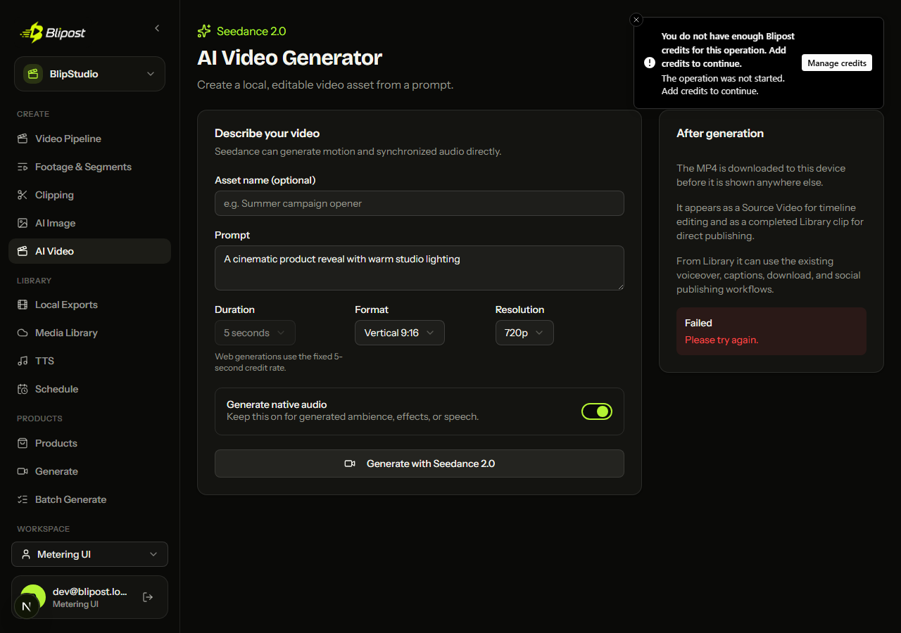

# BlipStudio credit metering

Status on 2026-07-15: the Studio side of Goal B2 is complete and committed
locally. No push or deployment was performed. The full Studio backend suite,
frontend checks, production build, and deterministic Chromium UI scenarios are
green. The final live two-application credit scenarios remain blocked by Goal
B1 web routing and local service-token provisioning described in
[Live integration blocker](#live-integration-blocker).

## Billing contract

Studio uses the canonical Goal B1 server-to-server API at
`/api/internal/studio/metering/{reserve,capture,refund}`. Requests use the
shared `studio_service_token` as a Bearer token and identify the customer by
the Supabase user UUID, with email as the documented fallback.

| Operation | Units | Credits per unit |
| --- | ---: | ---: |
| `studio.script_pipeline` | one unit per script-pipeline generation attempt | 2 |
| `studio.tts_variant` | one unit per generated voice-over variant | 9 |
| `studio.seedance_clip` | one fixed five-second Seedance clip | 205 |
| `studio.render_output_minute` | `max(1, ceil(output_seconds / 60))` | 4 |

Web mode is fail-closed. A denied reserve, missing identity, missing bridge
configuration, timeout, malformed response, or unavailable web bridge becomes
a local HTTP 402 and the provider/background operation is not started.

Desktop mode never calls the web bridge. It creates deterministic local
reservation IDs and emits structured reserve, provider-start, capture, and
refund usage logs with the same operation names and units. This preserves an
audit trail without enforcing credits during desktop early access.

## Durable lifecycle

Every attempt receives a stable idempotency key and a durable metering record.
The record contains the quoted operation and units, reservation ID, settlement
state, whether the provider started, result metadata, and the last settlement
error.

The common lifecycle is:

1. Persist the attempt before calling the bridge.
2. Reserve credits before dispatching background work or entering the render
   queue.
3. Mark `provider_started` immediately before the first paid provider or final
   render starts.
4. Persist the generated output in the owning Studio record/library.
5. Capture only after output persistence succeeds.
6. Refund on failure or cancellation. A failed capture/refund remains
   `capture_pending` or `refund_pending` and is retried by status polling or
   restart reconciliation with the same reservation and idempotency IDs.

Safe reserve replay is deliberately strict: a replay can execute only when the
durable record proves the provider has not started. This prevents a lost HTTP
response from creating a second paid provider call.

Restart reconciliation also closes the narrow terminal crash window where the
web ledger completed a capture/refund but Studio stopped before writing the
job's terminal status. A terminal ledger state plus durable output evidence is
translated into an honest completed/failed/cancelled job without dispatching
the provider a second time.

### Pipeline scripts and TTS

- New script generation and script regeneration each reserve one
  `studio.script_pipeline` unit before their asynchronous worker starts.
- Pipeline batch-script generation creates durable child attempts and reserves
  each one before dispatch. If a later reserve fails, every earlier reservation
  is released and no script provider starts.
- Each initial TTS variant and each regenerated variant reserves one
  `studio.tts_variant` unit. The metering record lives with the durable TTS job.
- Step 3 preview voiceovers use the same per-variant contract instead of a
  provider-only shortcut.
- Script/TTS cancellation refunds queued or running reservations. Late worker
  completion cannot overwrite a durable cancelled state.
- Interrupted jobs are reconciled honestly after process restart; unsettled
  reservations remain retryable.

### Standalone TTS, TTS Library, and Library voiceovers

- `POST /tts/generate` now creates a durable job first, reserves one
  `studio.tts_variant` unit before provider dispatch, checkpoints the output
  file before capture, and participates in the generic `/jobs` status, SSE,
  cancellation, and restart-reconciliation paths.
- TTS Library create/update generation reserves per generated asset, captures
  only after the asset is marked ready, and restores the previous asset when a
  replacement fails.
- Library clip voiceover regeneration reserves both TTS and a provisional final
  render quote while leaving the existing clip intact. After TTS persistence,
  it re-quotes the render from the exact processed-audio duration: when the
  minute boundary changes, the provisional render reservation is released and
  the exact reservation is acquired before FFmpeg starts. A denied exact quote
  refunds TTS and preserves the prior playable clip.
- These flows retry settlement with the same durable IDs and repair terminal
  capture/refund crash windows without repeating provider work.

### Pipeline final renders and remakes

Web renders calculate exact units from the current durable Step 2 audio. They
reject missing/stale TTS, an absent audio file, or an invalid duration instead
of estimating a billable output. Desktop keeps the prior flexible behavior and
logs an estimate when exact audio is unavailable.

All newly selected outputs are reserved before any fair-queue ticket is
registered. A partial multi-variant reserve is rolled back in full. Queue wait,
active cancellation, render failure, persistence failure, and interrupted
restart paths refund; successful library persistence precedes capture. Remakes
use the same lifecycle.

### Seedance

Web Seedance accepts exactly five seconds, matching the fixed B1 rate. Desktop
retains the previous 4-15 second controls. Reserve happens before the
background task, capture follows generated-video/source-video/library
persistence, and provider failure or cancellation refunds.

### Product generation and batch

A product job reserves one bundle before dispatch:

- quick voice-over: TTS plus final render;
- elaborate voice-over: script plus TTS plus final render.

Render units use the requested output duration. Batch generation creates all
durable child jobs first, reserves every child bundle, and refunds all earlier
children if any later reserve fails. Script/TTS work runs before a single fair
render ticket; that ticket spans composition and final encoding. The whole
bundle captures only after the final video is present in the library. Any
downstream failure or child/parent cancellation refunds every reserved bundle
component.

## Web compatibility surface

Historical provider/render compatibility endpoints could otherwise bypass the
launch metering contract. In web mode the following POST paths now fail with an
explicit desktop-only response before provider or render work starts; desktop
behavior remains available:

- `/jobs`
- `/tts/generate-legacy`
- `/tts/add-to-videos`
- `/assembly/preview`
- `/assembly/render`
- `/library/projects/{id}/generate`
- `/library/clips/{id}/render`
- `/library/clips/bulk-render`

The supported web launch paths are Pipeline (including preview/regeneration and
batch scripts), `/video-gen`, product and product-batch generation, standalone
TTS, TTS Library, Library voiceover regeneration, and final renders/remakes.

## Render queue reservation decision

Credits are reserved **before queue entry**, not when a render reaches the head
of the queue. A customer without enough credits therefore cannot occupy a fair
queue position or distort another tenant's ETA. The tradeoff is that credits
remain reserved while a valid job waits; queued cancellation, failure, and
restart recovery release them, while idempotent settlement makes retries safe.

`provider_started` is marked only after the fair ticket grants execution. Thus
the durable record still distinguishes a merely queued reservation from a
render that consumed compute.

## 402 user experience

The shared frontend API error handler recognizes HTTP 402, extracts the
backend's friendly structured message, states that the operation was not
started, and shows a **Manage credits** action for
`https://blipost.com/billing`. Pipeline, batch, Seedance, single-product, local
product batch, catalog batch, batch retry, standalone TTS, TTS Library, and
Library voiceover starts all use this guidance.

The web Seedance duration control is fixed and disabled at five seconds; the
desktop build retains the full duration list.

## Verification

- Focused backend tests cover contract validation, fail-closed bridge errors,
  insufficient credits before provider/background/queue start, desktop local
  logging, durable settlement retries, cancellation, failure refunds, exact
  render-minute calculation, multi-reservation rollback, batch propagation,
  and queue ordering.
- Three deterministic Chromium scenarios exercise Seedance, TTS Library
  creation, and Library voiceover regeneration. They submit real Studio UI
  requests against mocked contract-level 402 responses and assert the friendly
  billing action; Seedance also proves the web request is fixed to
  `duration: "5"`. Result: **3 passed**.
- Frontend TypeScript passes. ESLint reports **0 errors** (89 pre-existing
  warnings). A supported Next 16 Webpack production build, route generation,
  output tracing, and the standalone post-build static/public copy pass in an
  isolated copy. The original output directory could not be rebuilt in place
  because the already-running Electron standalone process holds
  `.next/standalone`; it was not terminated.
- Full Studio backend suite: **652 passed, 1 skipped, 18 xfailed, 0 failed**
  across 671 collected tests in 56.4 seconds.
- Metering-focused backend suite: **83 passed**. Legacy web guard suite:
  **15 passed**.
- Goal B1's `npm run studio-metering:check` passes its in-memory handler suite,
  including reserve/capture balance changes, refund, 402, auth, identity,
  ownership, and idempotency.

## Live integration blocker

A fresh real POST to the running local web app at
`/api/internal/studio/metering/reserve` returned HTTP 307 to
`/login?callbackUrl=%2Fapi%2Finternal%2Fstudio%2Fmetering%2Freserve` before the
Bearer-authenticated route handler ran.

The cause is in the web repository: private mode matches every path, while
`PRIVATE_MODE_PUBLIC_PREFIXES` does not include `/api/internal/studio`.
Goal B1's verifier invokes `handleStudioMeteringReserve` directly and therefore
does not cover `proxy.ts`. Since Goal B2 explicitly permits only reading and
running the web repository, no web code or persistent private-mode setting was
changed here.

The inspected local Studio settings also still use the production-default
`blipost_platform_base_url` and have no `studio_service_token`; the inspected
web `.env` has no matching `STUDIO_SERVICE_TOKEN`. No secret value was printed
or changed. Even with token provisioning, the current 307 remains the first
blocking boundary because the proxy runs before the route's Bearer check.

Before launch, Goal B1 must:

1. add `/api/internal/studio` to the private-mode public prefixes (the endpoint
   still performs its own constant-time Bearer authentication);
2. add a proxy-level regression proving the route is not redirected while an
   invalid Bearer token still receives 401;
3. provision the same high-entropy `STUDIO_SERVICE_TOKEN` on WEB and
   `studio_service_token` plus the local WEB base URL on Studio for the E2E
   environment;
4. rerun the three live local scenarios: sufficient credits and exact balance
   decrease, zero credits and the real UI 402, and desktop pass-through.

The installed in-app Browser skill was also missing its required
`scripts/browser-client.mjs` runtime. The committed Playwright/Chromium test and
screenshot provide browser evidence, but an interactive in-app-browser replay
could not be performed in this environment.

## Implementation commits

- `5e4d772` - add the Studio metering client and durable state machine
- `46251ae` - honor runtime metering settings
- `e51acb9` - meter Pipeline script and TTS jobs
- `159d050` - meter fair-queued Pipeline renders
- `0ce603c` - meter Seedance generation
- `6d102ef` - meter and queue product/batch jobs
- `bc20f3b` - show billing guidance in affected Studio flows
- `d787839` - meter Pipeline preview voiceovers
- `bb2e29a` - reconcile script-regeneration metering
- `12ade5a` - meter Pipeline batch scripts
- `4bc830e` - recover interrupted Pipeline reservations
- `51969cf` - recover interrupted render reservations
- `3308757` - recover interrupted Seedance reservations
- `9c59986` - recover interrupted product reservations
- `b1c54e0` - meter TTS Library generation
- `08d1aa2` - show TTS Library billing guidance
- `dd22315` - meter Library voiceover regeneration
- `25241ec` - meter standalone TTS generation
- `94e2aba` - close legacy web AI bypasses
- `bf18012` - recover terminal metering crash windows
- `185d393` - preserve the desktop-only guard contract
